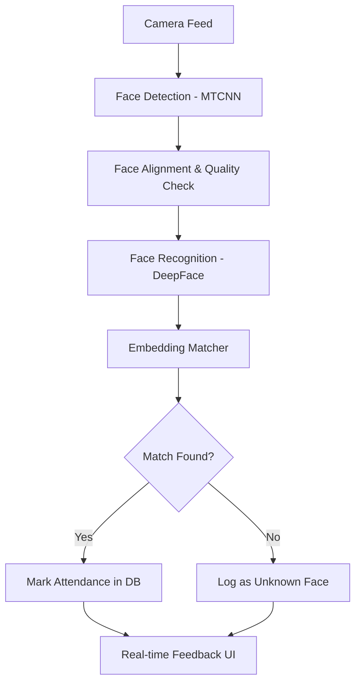

# Face Recognition Attendance System - System Explanation

Welcome to your system! This document is designed to take you from a complete beginner to an expert on how your code works, how it connects, and what happens when the application runs.

---

## 1. The Big Picture (The Flow)

Think of the system as a pipeline that processes light (images) into data (attendance records).



---

## 2. Component Roles (What does each part do?)

Your project is organized into specific folders. Here is the role of each:

### 📁 `config/`
*   **`settings.py`**: The "brain" of your configuration. It loads variables from your `.env` file (like your database URL).
*   **`database_config.py`**: Handles how we connect to the SQLite database.

### 📁 `database/`
*   **`models.py`**: Defines the "Structure" of your data. It tells the system what a "Student" or an "Attendance" record looks like in the database.
*   **`crud.py`**: The "Librarian". It contains functions to **C**reate, **R**ead, **U**pdate, and **D**elete data. (e.g., `add_student`, `mark_attendance`).

### 📁 `core/` (The Application Logic)
*   **`camera_handler.py`**: The **"Eyes"** of the system. It runs in its own thread so that even if the AI is busy thinking, the camera video stays smooth and never lags.
*   **`attendance_manager.py`**: The **"Executive"**. (Coming Soon) This manages the logic of when to mark someone present (e.g., they must be seen for 3 frames and we only mark them once per day).

### 📁 `models/` (The AI Engine)
*   **`face_detector.py`**: Uses **MTCNN** to find where faces are. For Phase 4, it now has a **"Security Guard"** role (`validate_for_enrollment`) that rejects captures if multiple people are in the frame or if the quality is poor.
*   **`face_recognizer.py`**: Uses **DeepFace**. It acts as the **"Translator"**, turning a physical face picture into a universal math language (Embedding).
*   **`embeddings_manager.py`**: The **"Vault Manager"**. It ensures that once a "fingerprint" is created, it's safely stored and can be retrieved in milliseconds.

### 📁 `scripts/` (The Toolbelt)
*   **`collect_student_data.py`**: The **"Registration Desk"**. This is how you introduce new people to the system. It handles the interaction between the camera and the database.
*   **`generate_embeddings.py`**: The **"Factory"**. It takes the "raw materials" (photos) and manufactures the "finished goods" (math vectors) that the AI actually uses.

### 📁 `data/` (The Warehouse)
*   **`student_images/`**: Stores the raw images. This is your **Ground Truth** dataset.
*   **`embeddings/cache.pkl`**: A fast-access copy of your embeddings. It’s like a **"Speed Dial"** for the AI's memory.

---

## 3. The Application Life Cycle

What happens when you press "Start"?

1.  **Initialization**:
    *   The system loads your database.
    *   The `EmbeddingsManager` loads all known student faces into memory from the cache.
2.  **Capture Loop**:
    *   The camera captures a frame.
    *   `FaceDetector` scans the frame. If it finds a face, it "clips" it out.
3.  **Recognition**:
    *   `FaceRecognizer` turns that clip into 512 numbers.
    *   The system compares these 512 numbers to all the 512-number vectors in your "Memory".
4.  **Action**:
    *   If the math "distance" between the vectors is low (e.g., `< 0.30`), we know who it is!
    *   The `AttendanceDB` saves the time and student ID.

---

## 4. Code Examples (How to use it)

Here is how you would use the components we just built in a simple script:

```python
from database.crud import AttendanceDB
from models.face_detector import FaceDetector
from models.face_recognizer import FaceRecognizer

# 1. Setup
db = AttendanceDB("sqlite:///database/attendance.db")
detector = FaceDetector()
recognizer = FaceRecognizer()

# 2. Process an image
import cv2
img = cv2.imread("test_face.jpg")

# 3. Detect
faces = detector.detect_faces(img)
for face in faces:
    x, y, w, h = face['box']
    crop = detector.extract_face(img, [x, y, w, h])
    
    # 4. Recognize
    embedding = recognizer.generate_embedding(crop)
    
    # 5. Match (Pseudo-code)
    # We compare this embedding to our database...
    print("Face processed and converted to math vector!")
```

---

## 5. Phase 4: Data Collection (Deep Dive)

In this phase, we moved from "How to recognize" to **"How to learn"**.

### The Enrollment Process (`collect_student_data.py`)
When you run this script, it doesn't just take photos. It performs a **Gatekeeper Check**:
1.  **Identity Verification**: It asks for an ID and checks the database so you don't overwrite another student.
2.  **Scene Validation**: It ensures the environment is perfect. If a friend walks behind the student, the AI says **"Multiple Faces Detected"** and stops the capture.
3.  **Stability Check**: If the student moves too fast, the **Blur Detector** blocks the capture. This ensures your AI only learns from "HD" quality data.

### The Training Process (`generate_embeddings.py`)
Once we have 55 photos, the system needs to "memorize" them.
1.  **Batch Processing**: Instead of doing one by one, it processes the whole 55-image set.
2.  **Mathematical Averaging**: By taking 55 different angles, the system builds a robust "average" of what that student looks like.
3.  **Permanent Sync**: It writes the results to your SQLite database for long-term storage and updates the `.pkl` file for instant recognition.

## 6. Phase 5: Real-time Attendance (The Heart)

This is where all the components meet.

### The Attendance Brain (`attendance_manager.py`)
This is the **"Executive Decision Maker"**:
1.  **Consecutive Frame Check**: The AI doesn't mark you present the instant it sees you for 0.1 seconds. It waits until it sees you for 3 frames (about 1 second) to be **absolutely sure**.
2.  **Cooldown Logic**: To prevent the database from filling up with 1,000 records of you, it only marks you once every 30 minutes. 
3.  **Active Tracking**: It keeps track of who is currently in front of the camera and resets the "surety count" if they walk away.

### The Unknown Face Logger (`unknown_face_handler.py`)
This is the **"Security Camera"**:
1.  **Evidence Collection**: If the system sees a face it doesn't recognize, it takes a photo and saves it in `data/unknown_faces/`.
2.  **Database Entry**: It logs the event in the database so an administrator can review it later (e.g., a new student you forgot to register).
3.  **Flood Control**: It won't take 1,000 photos of the same stranger. It waits 1 minute between snapshots.

---

## 7. Important Concepts for You

### What is an Embedding?
A face is complex. A computer cannot "see" eyes or a nose. An embedding is a unique mathematical "fingerprint". Even if you grow a beard, your embedding (math numbers) stays very similar, allowing the AI to stay accurate.

### Why WSL?
Because Python's Deep Learning libraries (TensorFlow) run much smoother and faster on Linux (Ubuntu). 

### 🚨 Camera Trouble in WSL? 🚨
If you are on Windows 10/11 using WSL2, you might see "Camera not found". This is because WSL is a virtual machine.
*   **Physical USB Webcams**: Use `usbipd-win` to "attach" the USB device to Ubuntu.
*   **Virtual Cameras (Camo, Nvidia Broadcast)**: These are software-only. They **cannot** be attached via USB.
*   **The Best Fix**: Use an **IP Camera** app on your phone (like DroidCam or IP Webcam) and provide the URL to the scripts. This works 100% of the time in WSL because it uses the network instead of a physical cable.

---
### What is the `tf-keras` fix we did?
New versions of TensorFlow (2.16+) changed how they handle AI models. We installed `tf-keras` to make sure your **DeepFace** library (which likes the older style) could still talk to the new TensorFlow.

---

**You are now ready to move to Phase 5!** In Phase 5, we will build the final system that watches the camera and marks attendance automatically.
