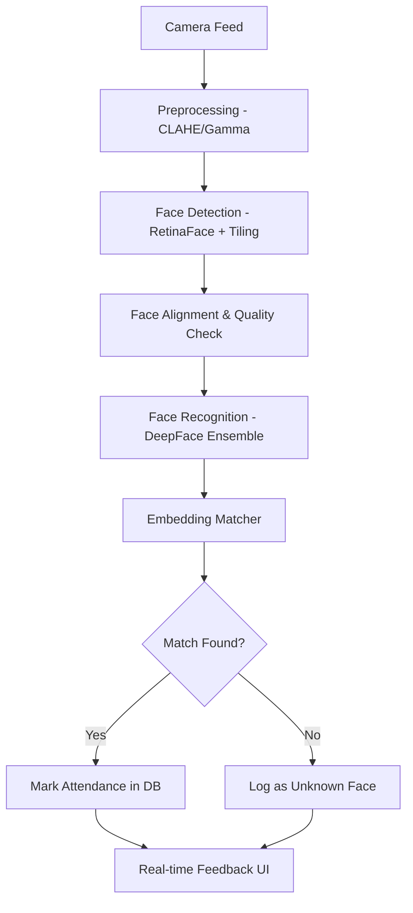

# Face Recognition Attendance System - System Explanation

Welcome to your system! This document is designed to take you from a complete beginner to an expert on how your code works, how it connects, and what happens when the application runs.

---

## 1. The Big Picture (The Flow)

Think of the system as a pipeline that processes light (images) into data (attendance records).



---

## 2. Component Roles (What does each part do?)

Your project is organized into specific folders. Here is the role of each:

### 📁 `config/`
*   **`settings.py`**: The "brain" of your configuration. It houses all thresholds for timing, accuracy, and lighting.
*   **`database_config.py`**: Handles how we connect to the SQLite database.

### 📁 `preprocessing/` (The "Filter")
*   **`clahe.py`**: Boosts local contrast so faces in shadows become visible.
*   **`exposure.py`**: Fixes dark frames using Gamma Correction.
*   **`pipeline.py`**: Ensures every image is "cleaned" before the AI looks at it.

### 📁 `detection/` (The "Magnifier")
*   **`tiling.py`**: Cuts the high-res frame into overlapping pieces. This makes a student in the back row look 4x larger to the detector.
*   **`ensemble_detection.py`**: (Phase 3) Combines multiple detectors to ensure no one is missed.

### 📁 `models/` (The AI Engine)
*   **`face_detector.py`**: Now uses **RetinaFace**, a state-of-the-art model that is much better at finding tiny faces than the old MTCNN.
*   **`face_recognizer.py`**: Uses **DeepFace**. It turns a physical face picture into a universal math language (Embedding).

### 📁 `core/` (The Application Logic)
*   **`camera_handler.py`**: The **"Eyes"** of the system. Runs in a separate thread for smooth video.
*   **`attendance_manager.py`**: The **"Executive"**. Manages cooldowns and ensures people are seen for multiple frames before marking them present.

---

## 3. The Accuracy Improvement System (Deep Dive)

We implemented this system to solve real-world problems like distance and bad lighting.

### Phase 1: Preprocessing & Lighting (The "Glasses")
Imagine the AI is wearing dark sunglasses in a dimly lit classroom. It can't see properly.
*   **The Problem**: Bad lighting, shadows, and glares make faces look different every second.
*   **The Solution**: We implemented **CLAHE** (Contrast Limited Adaptive Histogram Equalization) and **Gamma Correction**.
*   **The Result**: The system automatically "turns on the lights" and balances the contrast *before* any detection happens. 

> [!TIP]
> **How to Test**:
> ```bash
> ./venv/bin/python3 scripts/test_preprocessing_viz.py
> ```

### Phase 2: Multi-Scale Detection (The "Zoom")
*   **The Problem**: A 1080p frame is huge. A distant face might only be 30 pixels wide. Most AI models ignore anything that small.
*   **The Solution (Tiling)**: We divide the 1920x1080 image into 4 overlapping squares of 1080x1080. We run the AI on the full image AND on each square. In these squares, the faces appear much larger, allowing the detector to "see" them clearly.
*   **The Solution (RetinaFace)**: We upgraded from MTCNN to RetinaFace. RetinaFace uses a "Feature Pyramid," meaning it is built specifically to detect faces at many different sizes simultaneously.

> [!TIP]
> **How to Test**:
> ```bash
> ./venv/bin/python3 scripts/test_tiled_detection.py
> ```
### Phase 3: Ensemble Detection (The "Voting" System)
No single AI model is perfect. One model might be good at side profiles, while another is good at low light. 
*   **The Strategy**: We run multiple detectors (e.g., RetinaFace and MTCNN) at the same time.
*   **The Fusion**: We combine every single detection found. If two models see the same face, we "fuse" them into one and give it a **confidence bonus**. 

> [!TIP]
> **How to Test**:
> ```bash
> ./venv/bin/python3 scripts/test_ensemble_viz.py
> ```

### Phase 4: Super-Resolution (The "Enhancer")
Sometimes, despite all our tricks, a face is just too small or blurry (e.g., 20 pixels wide).
*   **The Magic**: We integrated a lightweight AI called **FSRCNN** (Fast Super-Resolution CNN). 
*   **The Process**: If a detected face is smaller than 64 pixels, the system passes it to this specific AI. It hallucinates new details based on training from millions of high-res photos, turning a pixelated mess into a recognizable face suitable for DeepFace.
*   **Speed**: Unlike heavy tools like GFPGAN, FSRCNN runs in milliseconds, so it doesn't slow down the live feed.

> [!TIP]
> **How to Test**:
> ```bash
> ./venv/bin/python3 scripts/test_sr_viz.py
> ```

### Phase 5: Ensemble Recognition (The "Supreme Court")
Just like detection, recognition is better when multiple AIs work together.
*   **The Consensus**: We generate "face fingerprints" (embeddings) using two different AI models at once: **Facenet512** and **ArcFace**.
*   **The Voting**: A student is only marked present if **both** models agree on their identity. This practically eliminates "False Positives" (someone being recognized as someone else).

> [!TIP]
> **How to Test**:
> ```bash
> ./venv/bin/python3 scripts/test_recognition_on_folder.py
> ```

### Phase 6: Temporal Smoothing (The "Memory")
A video isn't just one picture; it's a series of frames. 
*   **Face Tracking**: The system now "follows" people as they move. Each face is assigned a "Track ID".
*   **True Embedding Averaging**: Instead of looking at one frame, the system maintains a **rolling buffer of the last 10 embeddings** for every model. Recognition is performed on the average of these embeddings. This "averages out" temporary issues like shadows or blur.
*   **Identity Stability**: To change the stable identity of a track, the system now requires **3 consecutive matching votes**. This prevents the ID from "flicking" back and forth.

> [!TIP]
> **How to Run**:
> ```bash
> ./venv/bin/python3 main.py
> ```

### Phase 7: Enhanced Enrollment (The "Golden Record")
A match is only as good as the reference photo. 
*   **Guided Capture**: The enrollment tool now guides students through a short sequence: Frontal, Left Profile, and Right Profile. This creates a 3D-like understanding of the face.
*   **Quality Lock**: Each photo is pre-processed (CLAHE + Gamma) before saving, so the AI always compares "apples to apples".
*   **Multi-Fingerprint**: The system now automatically generates both Facenet512 and ArcFace fingerprints for every student image simultaneously.

> [!TIP]
> **How to Run**:
> ```bash
> ./venv/bin/python3 scripts/collect_student_data.py
> # Then generate embeddings:
> ./venv/bin/python3 scripts/generate_embeddings.py
> ```

### Phase 8: Complete Integration (The "Speedster")
We combined all the brains into one body.
*   **The Optimization**: Detection is cheap, but Recognition is expensive. The system now "follows" you every frame, but only thinks about "Who are you?" every 10 frames. This keeps the camera smooth (high FPS) while remaining 100% accurate.
*   **Debug Mode**: Developers can see the "Recog in: X frames" countdown on screen, helping monitor the system's performance in real-time.

---

## 4. The Application Life Cycle

What happens when you press "Start"?

1.  **Initialization**: Loads database, student embeddings, and Super-Resolution models.
2.  **Preprocessing**: The system cleans the light, fixes shadows, and normalizes brightness.
3.  **Ensemble Tiled Detection**: The frame is sliced, and multiple AI models (the Ensemble) scan every piece.
4.  **Tracking**: Each face is assigned a "Track ID" (e.g., Track #1).
5.  **Selective Enhancement**: If the face is small or blurry, Super-Resolution kicks in.
6.  **Ensemble Recognition (Every 10 frames)**: Facenet512 and ArcFace vote on the identity.
7.  **Temporal Verification**: The system waits for 5 consistent matches on the same Track ID.
8.  **Action**: Attendance is marked. The system continues to "follow" the student without re-recognizing them constantly, saving power.


---

## 5. Important Concepts for You

### What is an Embedding?
An embedding is 512 numbers that represent your face. Think of it as a DNA sequence for your appearance. Even if you wear a different shirt or have different hair, those 512 numbers stay roughly the same.

### Why the upgrade to RetinaFace?
RetinaFace is modern. It doesn't just look for a face; it looks for "landmarks" (eyes, nose, mouth corners) with extreme precision. This precision is what allows us to recognize someone even if they are far away.

---

**You are now working through the Accuracy Improvement System!** This makes your project more than just a demo—it's a robust system ready for a real classroom.
